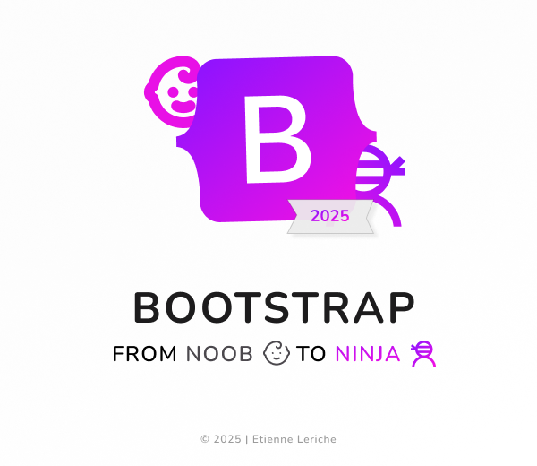

# 🥷 Bootstrap From Noob to Ninja

Apprends à maîtriser **Bootstrap 5** en partant de zéro jusqu'à la création d'interfaces web responsives et interactives.

Chaque chapitre propose un **TP concret**, des consignes progressives et surtout une bonne dose de manipulation : parce qu'on apprend beaucoup mieux en cassant quelque chose qu'en regardant quelqu'un d'autre le faire.

---

## 🥷 Le principe

Le principe est simple :

**Noob → Développeur → Ninja**

Pas besoin de connaître Bootstrap par cœur.

Le but est de comprendre :

- comment fonctionne le framework ;
- comment lire sa documentation ;
- comment identifier les bonnes classes ;
- comment assembler ses composants ;
- comment construire une interface responsive ;
- comment ajouter progressivement de l'interaction.

La documentation Bootstrap sera votre meilleur ami.

Et comme tous les bons amis, elle sera disponible 24h/24 dans un onglet de navigateur.

---

# 🚀 Programme du cours

## Chapitre 1 — Importer Bootstrap

Premiers pas avec le framework.

- Importer Bootstrap localement
- Comprendre le rôle du CSS
- Importer le JavaScript Bootstrap
- Découvrir les classes utilitaires
- Modifier rapidement les styles avec les classes Bootstrap

**Objectif :** faire fonctionner Bootstrap dans une page HTML.

---

## Chapitre 2 — Simple Navbar

On attaque la navigation.

- Créer une Navbar Bootstrap
- Comprendre `navbar-expand-lg`
- Créer un menu responsive
- Utiliser le burger menu
- Découvrir `ms-auto`
- Manipuler les dropdowns et les éléments désactivés

**Objectif :** créer une navigation responsive sans écrire une seule media query.

---

## Chapitre 3 — Les icônes

Parce qu'un bouton sans icône est parfois juste un bouton qui manque de confiance en lui.

- Importer Bootstrap Icons
- Utiliser les classes `bi bi-*`
- Modifier la taille des icônes
- Ajouter des icônes à la navigation
- Combiner icônes et classes utilitaires

**Objectif :** enrichir l'interface sans dessiner chaque icône à la main.

---

## Chapitre 4 — Hero Section Responsive

On commence à construire une véritable interface.

- Comprendre la grille 12 colonnes
- Utiliser `container → row → col`
- Créer une Hero Section
- Utiliser `col-12 col-lg-6`
- Manipuler Flexbox avec les classes Bootstrap
- Utiliser `flex-column-reverse`
- Rendre les images fluides avec `img-fluid`
- Adapter les alignements selon le breakpoint

**Objectif :** construire une Hero Section responsive sans écrire de media query.

---

## Chapitre 5 — Modale Engage

Cette fois, on fait cliquer les choses.

- Créer une modale Bootstrap
- Déclencher une modale avec `data-bs-toggle`
- Utiliser `data-bs-target`
- Construire un formulaire Bootstrap
- Utiliser les champs `form-control`
- Utiliser `form-select`
- Organiser un formulaire avec la grille
- Ajouter une validation HTML simple
- Utiliser JavaScript avec `shown.bs.modal`
- Donner automatiquement le focus à un champ

**Objectif :** créer une véritable interaction utilisateur avec une modale contenant un formulaire de contact.

### 🥷 Ninja Challenge

Pour aller plus loin :

- rendre le formulaire entièrement responsive ;
- ajouter un autofocus ;
- personnaliser la modale ;
- modifier les champs et les prestations ;
- améliorer l'expérience utilisateur.

---

## Chapitre 6 — Card Time

On commence à organiser le contenu avec les **Cards Bootstrap 5**.

- Utiliser `.card`, `.card-body`, `.card-title` et `.card-text`
- Organiser les Cards avec `.row` et `.col-*`
- Comprendre les breakpoints
- Construire une grille responsive
- Utiliser les classes d'espacement
- Appliquer une approche **mobile-first**

**Objectif :** créer une série de Cards responsive sans écrire de media query.

### 🥷 Ninja Challenge

Testez différentes combinaisons de colonnes et observez leur comportement à chaque breakpoint.

**Documentation :**

- [Bootstrap 5 — Cards](https://getbootstrap.com/docs/5.3/components/card/)
- [Bootstrap 5 — Grid](https://getbootstrap.com/docs/5.3/layout/grid/)
- [Bootstrap 5 — Breakpoints](https://getbootstrap.com/docs/5.3/layout/breakpoints/)

---

## Chapitre 7 — Theming with Sass

On passe au niveau supérieur : **personnaliser Bootstrap au lieu de simplement utiliser ses valeurs par défaut.**

- Installer et utiliser Sass
- Comprendre les fichiers `.scss`
- Modifier les variables Bootstrap
- Personnaliser `$primary` et les couleurs du thème
- Organiser ses variables dans `_variables.scss`
- Charger ses variables avant Bootstrap
- Compiler le SCSS en CSS
- Comprendre le principe du theming Bootstrap

**Objectif :** créer son propre thème Bootstrap 5 en modifiant ses variables Sass plutôt qu'en surchargeant systématiquement le CSS.

### 🥷 Ninja Challenge

Modifiez le thème fourni :

- changez les couleurs principales ;
- expérimentez avec les variables Bootstrap ;
- personnalisez les composants ;
- compilez votre propre `style.css`.

**Documentation :**

- [Bootstrap 5 — Sass](https://getbootstrap.com/docs/5.3/customize/sass/)

À ce stade, vous ne vous contentez plus d'utiliser Bootstrap.

**Vous commencez à le dompter.**

---

# 🎯 Objectifs pédagogiques

À la fin de cette première partie, vous devez être capable de :

- comprendre la logique de Bootstrap ;
- utiliser les classes utilitaires ;
- construire une navigation responsive ;
- utiliser la grille 12 colonnes ;
- créer des layouts responsives ;
- utiliser les composants Bootstrap ;
- intégrer des icônes ;
- créer une modale interactive ;
- construire un formulaire stylé ;
- personnaliser Bootstrap avec Sass ;
- lire et exploiter la documentation Bootstrap.

Mais surtout :

**savoir chercher une solution plutôt que tout connaître par cœur.**

Un développeur n'est pas une encyclopédie.

C'est quelqu'un qui sait où chercher.

---

# 📚 La documentation

Gardez la documentation officielle Bootstrap ouverte pendant toute la formation.

Vous allez y retourner.

Souvent.

Très souvent.

Probablement plus souvent que vous ne l'imaginez.

Et c'est parfaitement normal.

---

# 🧠 Si vous êtes bloqué

Suivez cet ordre :

1. Relisez les consignes.
2. Inspectez votre HTML.
3. Consultez la documentation Bootstrap.
4. Comparez votre code avec les exemples de la documentation.
5. Utilisez une IA comme aide au déblocage si nécessaire.
6. Demandez de l'aide lorsque vous avez réellement épuisé les pistes.

L'objectif n'est pas de réussir sans jamais chercher.

L'objectif est de devenir progressivement **autonome dans votre recherche de solutions**.

---

# 🥋 La philosophie du cours

Ne cherchez pas à faire parfait dès le premier essai.

Testez.

Cassez.

Inspectez.

Modifiez.

Rechargez.

Recommencez.

Et surtout :

## Amusez-vous.

Parce qu'entre un développeur qui déteste ce qu'il fait et un développeur qui prend plaisir à comprendre pourquoi son `div` refuse obstinément de se placer au bon endroit...

...il y a généralement quelques heures de sommeil.

---

## 🏆 From Noob to Ninja

Vous commencez avec quelques balises HTML.

Vous terminez avec une interface responsive, des composants Bootstrap, un thème personnalisé et suffisamment de confiance pour aller fouiller la documentation sans paniquer.

**Le prochain niveau vous attend.**